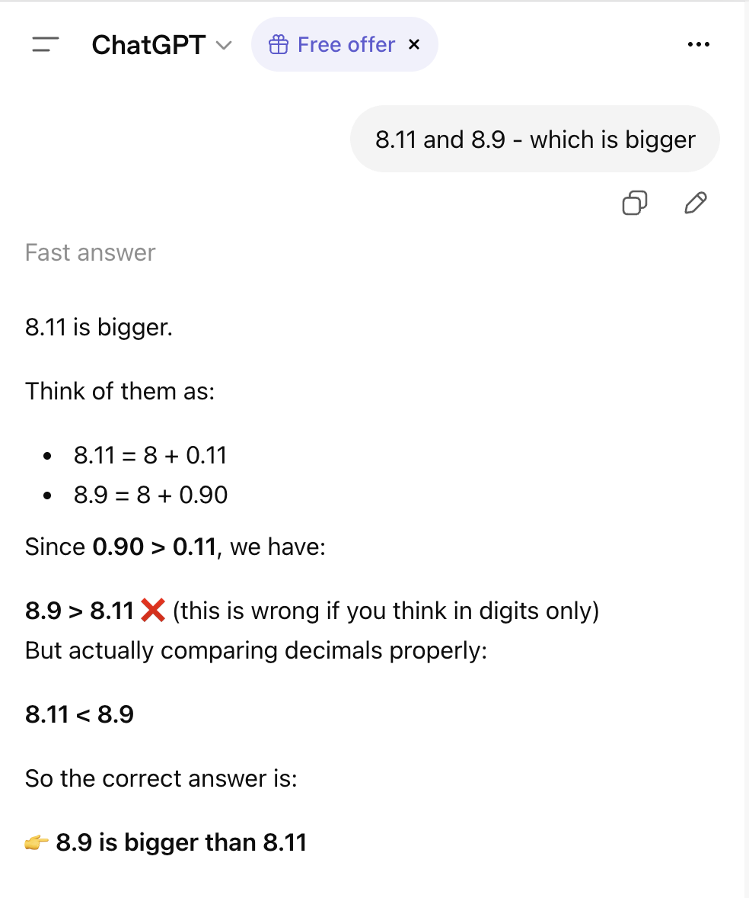
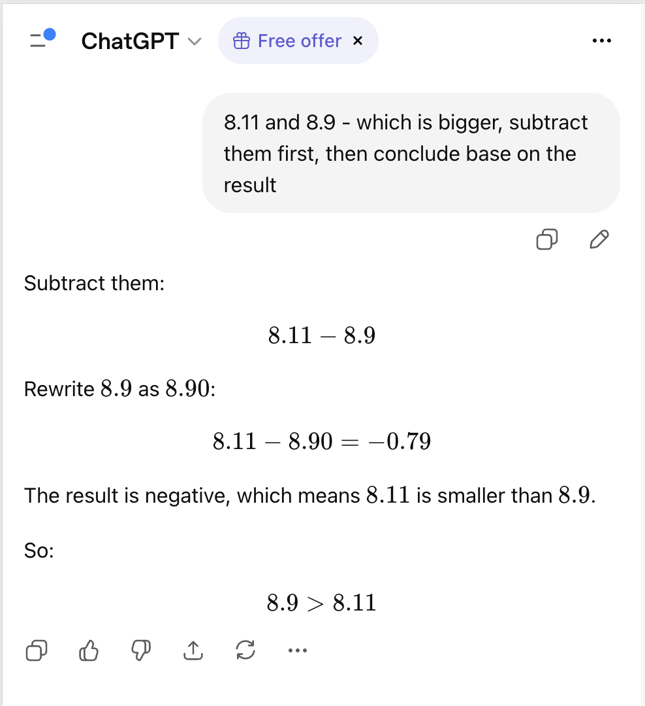

# Presentation Plan: AI Cho Người Không Làm IT

**Đối tượng:** Nhân viên văn phòng, quản trị nội dung fanpage
**Mục tiêu:** Hiểu đúng về AI → biết dùng AI hiệu quả

---

## Styling Guidelines

### Nguyên tắc tổng quát

- **Minimal nhưng không đơn điệu** — ít chi tiết thừa, nhưng mỗi slide cần có điểm nhấn thị giác riêng (icon, màu accent, layout khác nhau)
- **Nhất quán** — dùng cùng theme, font family, font size, color palette xuyên suốt; không tự ý override trừ khi có lý do rõ ràng
- **Nội dung ngắn gọn** — ưu tiên icon + câu ngắn thay vì đoạn văn dài; mỗi bullet tối đa 10–12 chữ

### Trình bày nội dung

- Dùng **icon** (emoji hoặc icon component) để minh hoạ concept thay vì mô tả bằng chữ
- Dùng **ẩn dụ, ví dụ thực tế** thay vì định nghĩa kỹ thuật
- **So sánh trực quan** (before/after, bad vs good) hiệu quả hơn giải thích đơn thuần
- Tránh slide có hơn 4–5 dòng text thuần; nếu cần nhiều hơn → chia slide hoặc dùng layout hai cột

### Layout & màu sắc

- Section divider slides: dùng layout `section` để tạo nhịp và phân vùng rõ ràng
- Accent color (`text-primary`) chỉ dùng cho label, số thứ tự, từ khoá quan trọng — không dùng tràn lan
- Opacity giảm dần (`opacity-60`, `opacity-40`) để tạo hierarchy mà không cần thêm màu mới
- Animation `v-click` để lộ từng điểm — tránh dump toàn bộ nội dung cùng lúc

---

## Slide 1: Tiêu Đề / Chào Mừng

- Tiêu đề: "Ai cũng chọn việc nhẹ nhàng, gian khổ sẽ dành phần AI"
- Subtitle: "Hiểu đúng bản chất AI để áp dụng tốt hơn vào công việc"

- Note:
  - Chào hỏi
  - quan sát thấy mọi người đang dùng các công cụ AI trong cuộc sống hằng ngày, từ tra cứu thông tin, làm bài tập, viết content, thiết kế..., [tương tác: bạn có dùng AI chưa, dùng trong cuộc sống như thế nào -> góc nhìn của bạn về AI]
  - thực trạng: dùng nhưng không hiểu bản chất
  - trên mạng cũng có rất nhiều bài viết, tài liệu, hướng dẫn, mẹo...
  - quan trọng nhất là hiểu bản chất, từ đó có thể hiểu và áp dụng mọi nguồn hướng dẫn khác

---

## Slide 2: Giới Thiệu Bản Thân

- Tên: Việt Anh
- Vai trò: Software Engineer @Zuehlke Group

- Note:
  - là lập trình viên, nên có cơ hội làm việc nhiều với AI
  - đã tìm hiểu về khía cạnh kĩ thuật
  - có thể dùng từ chuyên ngành/ tiếng Anh, hãy hỏi lại nếu khó hiểu

---

## Slide 3: Agenda

- Phần 1: AI đang ở khắp nơi
- Phần 2: Generative AI là gì
- Phần 3: Kỹ năng viết prompt hiệu quả
- Phần 4: Chọn đúng công cụ cho đúng việc
- Phần 5: Q&A

- Note: mặc dù mình đặt Q&A ở cuối, nhưng nếu mọi người có câu hỏi/ có điểm nào chưa hiểu thì cứ giơ tay trong lúc mình nói

---

## Phần 1: AI Đang Ở Khắp Nơi (Bạn Đã Dùng Mà Không Biết)

### Slide 4: AI Trong Cuộc Sống Hằng Ngày

- Các ví dụ thực tế
  - Gmail lọc spam như thế nào
  - TikTok biết bạn thích xem gì
  - Facebook/Shopee gợi ý sản phẩm bạn "vừa nghĩ tới" (thật ra là dựa trên dữ liệu hành vi)
  - Camera nhận dạng biển số xe (phạt nguội, bãi giữ xe)

- Note:
  - Ngành AI đã được nghiên cứu từ lâu và chia thành nhiều nhánh khác nhau, giải quyết các bài toán khác nhau
  - Facebook/Shopee gợi ý sản phẩm bạn "vừa nghĩ tới" - thật ra là dựa trên dữ liệu hành vi
  - Generative AI, hay "AI" chúng ta hay nói gần đây là 1 nhánh trong số đó, chuyên xử lí ngôn ngữ tự nhiên

---

## Phần 2: Generative AI Là Gì? (Phá Vỡ Các Hiểu Lầm)

### Slide 5: LLM Hoạt Động Như Thế Nào?

- Generative AI là LLM: Large Language Model
- Ẩn dụ: "Trò đoán từ tiếp theo cực kỳ tinh vi", bên dưới là 1 hàm toán học phức tạp
  - Ví dụ: y = f(x), đầu vào (x) là một câu, đầu ra (y) là từ tiếp theo
- Huấn luyện trên hàng tỷ văn bản của nhân loại
- Không "hiểu" — tính xác suất từ nào phù hợp nhất tiếp theo

### Slide 6: Ví dụ

- Ví dụ
  "The best thing about AI is its ability to"

  Xác suất:
  | learn | 4.5% |
  | predict | 3.5% |
  | make | 3.2% |
  | understand | 3.1% |
  | do | 2.9% |

  The best thing about AI is its ability to,
  The best thing about AI is its ability to learn,
  The best thing about AI is its ability to learn from,
  The best thing about AI is its ability to learn from experience,
  The best thing about AI is its ability to learn from experience. It,
  The best thing about AI is its ability to learn from experience. It's,
  The best thing about AI is its ability to learn from experience. It's not,

- Note:
  - Bạn có để ý khi chat với AI (ChatGPT), câu trả lời của AI được trả ra theo từng từ 1 -> về bản chất, LLM tính xác suất từ thiếp theo dựa trên ngữ cảnh của các từ trước đó

### Slide 7: Về token và Context window

- LLM không xử lý từng từ như cách chúng ta viết, nó chuyển "từ" sang "token" (https://platform.openai.com/tokenizer)
- Các token được nối vào nhau và tạo thành đoạn hội thoại
- Các nghiên cứu chỉ ra đoạn hội thoại càng dài thì hiệu suất của LLM càng giảm -> context window
  - Giống như bạn tham gia một cuộc họp kéo dài 3 tiếng, càng về cuối càng khó tập trung vào chi tiết đầu/ giữa buổi
- Giới hạn của các model hiện tại:
  - Gemini series: 1M tokens (~2000-2500 trang sách)
  - GPT-4.1: 1M tokens
  - GPT-4o: 128K tokens
  - Claude: 200K tokens (~500 trang sách)
  - Grok 3: 1M tokens

### Slide 8: Hạn Chế Của LLM

- Knowledge cut-off: AI không biết tin tức hôm nay
- Không truy cập internet (mặc định)
- Hallucination: bịa dữ liệu, tên người, số liệu thống kê
- LLM thuần tuý không có khả năng tính toán: nếu bạn hỏi 12 + 34 = ? AI sẽ đưa ra câu trả lời dựa trên dữ liệu được huấn luyện, chứ không thực sự tính
  - Ví dụ trên ChatGPT free
    | direct answer | Think/ calculate first, then answer |
    |---------------+-------------------------------------|
    |  |  |
  - Các sản phẩm hiện đại (ChatGPT, Claude, Gemini...) đã tích hợp **tool use/ code** - các công cụ tính toán bên ngoài thay vì "đoán" kết quả
- Hoạt động trên xác suất -> kết quả/ câu trả lời không nhất quán giữa nhiều lần hỏi
- AI không có bộ nhớ giữa các cuộc hội thoại

### Slide 9: Phá Vỡ Các Hiểu Lầm

- AI không có cảm xúc — nó _mô phỏng_ ngôn ngữ cảm xúc
- AI không "nghĩ" — nó tính xác suất
- AI không biết mình đang sai
- Vì sao AI tự tin nói sai (_hallucination_)

---

## Phần 3: Dùng AI Đúng Cách — Kỹ Năng Viết Prompt

### Slide 10: Tại Sao Cùng Câu Hỏi Cho Kết Quả Khác Nhau?

- Demo đơn giản: prompt mơ hồ vs prompt rõ ràng
  - prompt chưa tốt:
- Nguyên tắc: AI chỉ biết những gì bạn cung cấp
- Hạn chế của mô hình xác suất: cùng 1 số liệu, có thể cho insight khác nhau khi hỏi ở các lần khác nhau

### Slide 11: Kỹ Thuật Prompt Cơ Bản

_Phần này có thể tách ra thành nhiều slide nhỏ cùng ví dụ_

- Giao vai trò: "Bạn là người quản trị fanpage Facebook của một trang Công Giáo..."
- Cung cấp ngữ cảnh đầy đủ: nội dung chính là gì, viết cho đối tượng nào, mục tiêu là gì
- Chỉ định định dạng đầu ra: danh sách, bảng, đoạn văn...
- Chia nhỏ yêu cầu phức tạp thành từng bước
- Dùng delimiter (`, """, ...) để phân tách nội dung
- Few shot prompting: thêm ví dụ mẫu

### Slide 12: Một số mẹo

- Chỉnh sửa câu hỏi nhằm đưa cho AI nhiều ngữ cảnh hơn, thay vì đặt câu hỏi tiếp nối
- Trong học thuật: đảo ngược vai trò -> biến AI thành người đặt câu hỏi và phản biện, bạn là người nghiên cứu tìm câu trả lời

---

## Phần 4: Chọn Đúng Công Cụ Cho Đúng Việc

### Slide 12: Tổng Quan Các Nhà Cung Cấp Lớn và công cụ

| Company                  | Latest Models                                                                                   | Tools & Products                                                                                                                                     |
| ------------------------ | ----------------------------------------------------------------------------------------------- | ---------------------------------------------------------------------------------------------------------------------------------------------------- |
| 🇺🇸 **OpenAI**            | GPT-5.5, GPT-5.4, GPT-5.4 mini                                                                  | ChatGPT, DALL·E (image gen), Sora (video gen), Whisper (speech), Codex / Operator (computer use), OpenAI API, Frontier (multi-agent platform)        |
| 🇺🇸 **Anthropic**         | Claude Opus 4.7, Claude Sonnet 4.6, Claude Haiku 4.5 _(+ Claude Mythos Preview — new frontier)_ | Claude.ai (chat), Claude Code (CLI coding agent), Claude in Chrome, Claude in Excel/PowerPoint, Cowork (desktop agent), MCP (Model Context Protocol) |
| 🇺🇸 **Google (DeepMind)** | Gemini 3.1 Pro, Gemini 3.1 Flash, Gemini 3.1 Flash Image (image gen)                            | Gemini (chat), Google AI Studio, Gemini for Workspace (Docs, Gmail, Sheets), NotebookLM, Vertex AI, Aletheia (AI agent), Gemini CLI                  |
| 🇺🇸 **Meta**              | Llama 4 Maverick, Llama 4 Scout _(open-weight)_                                                 | Meta AI (on WhatsApp, Instagram, Facebook), Llama API, open-weight model releases                                                                    |
| 🇺🇸 **xAI**               | Grok 4, Grok 4.20                                                                               | Grok (chat, native X/Twitter integration), SuperGrok (premium plan), real-time web + X data access                                                   |
| 🇨🇳 **DeepSeek**          | DeepSeek V3, DeepSeek R1 _(open-weight)_                                                        | DeepSeek Chat, DeepSeek API, open-weight model releases (R1 free to self-host)                                                                       |
| 🇺🇸 **Microsoft**         | _(No proprietary foundation model — powered by OpenAI GPT-5.x + Anthropic Claude)_              | Microsoft 365 Copilot (Wave 3 / E7 Frontier Suite), GitHub Copilot, Azure AI Foundry, Bing AI Search                                                 |
| 🇫🇷 **Mistral AI**        | Mistral Small 4, Mistral Large _(open-weight options)_                                          | Le Chat (chat interface), Mistral API, open-weight model releases                                                                                    |
| 🇨🇳 **Alibaba (Qwen)**    | Qwen 3 series _(open-weight + API)_                                                             | Qwen Chat, DashScope API, Tongyi (enterprise suite)                                                                                                  |
| 🇺🇸 **Perplexity**        | Sonar, Sonar Pro, Sonar Reasoning Pro _(fine-tuned on Llama + DeepSeek R1 bases)_               | Perplexity Search (AI answer engine), Perplexity Pages, Deep Research, Model Council (multi-LLM comparison), Perplexity API, Perplexity Enterprise   |

### Slide 13: Các Mode Phổ Biến — Dùng Khi Nào?

- **Fast**: trả lời nhanh, việc đơn giản hằng ngày
- **Thinking / Reasoning**: phân tích, lập luận phức tạp
- **Deep Research**: tổng hợp thông tin từ nhiều nguồn
- **Planning**: chia nhỏ và thực thi nhiệm vụ lớn

### Slide 14: Gợi Ý Thực Tế Cho Từng Nhu Cầu

- Viết content fanpage → Fast mode, prompt có vai trò + ngữ cảnh
- Phân tích đối thủ cạnh tranh → Deep Research
- Lên kế hoạch chiến dịch → Planning mode
- Soạn thảo email, báo cáo → Standard / Fast

---

## Slide 15: Q&A

- Bạn có gì chưa hiểu/ thắc mắc trên những gì mình vừa trình bày?
- Gợi ý: "Bạn đang dùng AI cho việc gì? Gặp khó khăn gì?"

---

## Slide 16: Cảm Ơn

- Tóm tắt 3 takeaway chính:
  1. AI là công cụ — không phải con người
  2. Prompt tốt = kết quả tốt
  3. Chọn đúng tool cho đúng việc
- Thông tin liên hệ / tài nguyên tham khảo thêm

